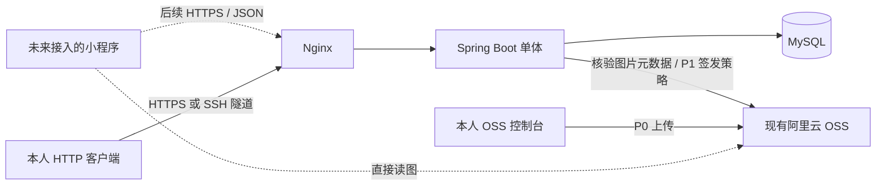

# QuePhoto Java 版本计划书：7 天 MVP 与项目驱动学习

编制日期：2026-10-01。状态：基于原项目文件及用户补充范围形成的实施建议，尚未开始 Java 编码或服务器部署。

**目标：在国庆 7 天内，用 Java 做出可以部署并实际维护摄影内容的管理后端；每天按 3–4 小时保底，学会独立修改这个项目所需的 Java 基础。现有已上线小程序继续运行，本轮不改前端。**

这不是把原 C# 项目逐行翻译成 Java。复用的是作品集模型、业务规则、API 语义和现有小程序；重做的是后端实现、数据库迁移、认证与部署。

配套文件：

- [7 天实战教程：每天一个文件](D:/Project/QuePhoto_java/Plan/7天实战教程/README.md)：按步骤学习和开发，包含代码、命令、原理与每日验收。
- [数据库与 API 实施基线](D:/Project/QuePhoto_java/Plan/QuePhoto_Java_数据库与API实施基线.md)：建表、接口、原设计冲突及迁移边界。
- [每日任务与上线验收](D:/Project/QuePhoto_java/Plan/QuePhoto_Java_每日任务与上线验收.md)：每天照着执行的任务、学习练习、部署和回滚清单。

## 1. 先明确 7 天能够交付什么

用户可保证 **每天 3–4 小时，累计 21–28 小时**。完整 P0 按 **28 小时挑战目标**编排，已经包含学习、实现、验收和少量排障缓冲；不是 21 小时完成全部功能的保证。若实际只有 21 小时，先保住安全的内容维护闭环，完整 P0 可能需要顺延。已有其他语言经验、AI 辅助样板代码和严格控制范围，是这份估算的前提。

已确认：小程序已有代码，已上线使用；本轮只做管理后端重构，前端以后按新接口修改；服务器和域名尚未购买。首周不安排小程序 UI、管理前端 UI、微信提审或客户端切换。如果国庆从 2026-10-01 开始执行，D1–D7 对应 10 月 1–7 日；实际启动时间可整体平移。

第 7 天的目标用户流程：

1. 摄影师用保存好的 HTTP 请求集合登录并创建草稿作品集。
2. 从现有 OSS 选择图片，或本人通过 OSS 控制台上传；通过受控导入流程登记到作品，选择封面和已有标签。
3. 发布后，用公开 API 查询作品列表和详情，验证未来前端将拿到的真实数据。
4. 通过管理 API 修改文字、图片顺序和标签，把作品改回草稿以停止新 API 的公开展示。
5. Java 服务部署到 Linux，重启后内容不丢失，有可恢复的数据库备份；域名就绪则启用 HTTPS，未就绪则通过 SSH 隧道供本人管理使用。

**本轮“投入使用”定义为你已经能在服务器上的新后端管理真实内容。** 它不等于现有小程序已切换到新后端；在未来接入前，新后端的发布/下架操作不会改变旧小程序展示的数据。对外 HTTPS 接入与微信域名配置作为后续切换条件，不能将新购域名等同于当天即可完成所有上线手续。

学习目标也应具体：首周结束时能够看懂并独立修改 Controller → Service → Mapper → MySQL 的一个完整功能，解释鉴权、图片导入与 OSS 直读过程，运行测试、排查日志并完成一次部署。签名直传的实现随 P1 学习；Java 并发、JVM、Spring 源码和完整面试体系放在后续学习中。

## 2. 原项目读取结论

本次读取了 `D:\Project\QuePhoto3.0` 下的 AGENTS、三份 Markdown 规划文档、OpenAPI、控制器、DTO、实体、DbContext、种子、迁移，以及 SQLite 的只读结构和数据概况；也阅读了当前 Java 目录中的半年转型规划。未改动原项目。以下技术现状来自本地文件，已上线小程序的状态来自用户确认。

| 依据 | 关键结论 | Java 版本处理 |
|---|---|---|
| [原项目约定](D:/Project/QuePhoto3.0/AGENTS.md) | 复用现有小程序；图片直连 OSS；数据库保存 ObjectKey；避免过度架构 | 保留这些原则；用户此次明确改用 Java，覆盖原文的 C# 技术栈限制 |
| [数据库设计](D:/Project/QuePhoto3.0/Docs/Plans/摄影作品小程序-数据库建模设计.md) | 作品集是业务主体；5 张核心表；Work/Scene 图片、两级标签、拍摄时间精度 | 保留领域结构，不改造成 Photo + Album + User 模型 |
| [已确认 API 契约](D:/Project/QuePhoto3.0/Docs/Plans/摄影作品平台_V1_API接口契约.md) | 草稿/发布、单管理员、JWT、分页、OSS 签名上传 | 作为行为基线；首周只实现明确标出的 MVP 子集 |
| [原 OpenAPI](D:/Project/QuePhoto3.0/Docs/Plans/QuePhotoV1.openapi.yaml) | 已有路由骨架，但部分请求/响应不完整，图片更新 schema 有歧义 | 不能原样作为生成代码的依据；按实施基线补齐 |
| [原 C# 开发指南](<D:/Project/QuePhoto3.0/Docs/Plans/摄影作品平台_CSharp_从0到1开发指南 (1).md>) | 覆盖多个阶段，管理员表等建议早于确认契约 | 复用学习方式，不把全部阶段塞入一周 |
| [现有半年转型规划](D:/Project/QuePhoto_java/Plan/Java后端转型规划_2026-10至2027-04.md) | 长期学习目标合理，但通用 Photo/Album/User 和 MinIO 等建议与本项目最新设计不一致 | 本次具体业务计划优先；上线后继续补基础，不要求为学习强行加入所有组件 |

已实现的 C# 内容只有基础公开作品列表/详情、创建作品接口、5 表建模与开发种子。**登录、发布过滤、分页筛选、完整管理、OSS 直传和部署均不能视为已完成。** 原目录未发现小程序源码、管理前端、自动化测试或部署文件；用户已确认小程序在运行，本轮无需寻找或修改它的仓库。

只读检查的 SQLite 中有 5 个作品、3 张图片、2 个标签组、4 个标签、6 条作品标签关联；其中 2 个作品没有图片。图片 Key 是 `portfolios/demo/...` 样例路径，未验证 OSS 中存在对应对象。因此不能将这个库整体自动发布为生产内容。

## 3. 首周范围

| 能力 | 首周决定 | 验收边界 |
|---|---|---|
| 公开作品列表、详情、分页 | 必须 | 仅 published；pageSize 最大 50；通过 HTTP 请求验收 |
| 单二级标签筛选、标签树 | 必须 | 保留“每个标签组最多选一个标签” |
| 草稿、发布、下架 | 必须 | 下架即 published → draft；草稿公开详情返回 404 |
| 单管理员登录 | 必须 | 环境变量中的用户名/密码哈希；JWT；所有管理 API 受保护 |
| 创建、编辑作品；图片顺序、封面、标签选择 | 必须 | 通过 API 维护，提供可复用请求集合和说明 |
| 既有 OSS 图片/控制台新上传图片的受控导入 | 必须 | 本人通过服务器本地导入命令登记；不开放任意 ObjectKey 登记入口 |
| OSS 签名直传与在线图片登记 | 额外时间增强 P1 | 核心验收完成后再投入 6–10h；文件不经过 Java 服务 |
| Work 和 Scene | 保留模型及基本读写 | 可选场景图，无复杂分组操作 |
| 独立分享图 | 延期管理功能 | 暂以封面作为分享展示图；保持 shareImageUrl 字段 |
| 标签组/标签完整增删改管理 | 延期 | 首周用受版本管理的初始标签，API 支持为作品选择标签 |
| 物理删除作品、图片和 OSS 对象 | 延期 | 首周以下架替代；不会宣称已支持原契约的 DELETE |
| 新做相册、普通用户/微信登录、评论、点赞、收藏 | 不做 | 当前个人作品展示不需要 |
| Redis、消息队列、微服务、AI、搜索、EXIF 自动提取 | 不做 | 先获得真实使用反馈，再按需求引入 |

P0 交付物：Java 后端、5 表 MySQL 迁移、图片导入命令、可复用 HTTP 请求集合、固定的 OpenAPI 契约、部署配置、使用说明、关键测试和一次备份恢复记录。

使用 IDE HTTP Client、Postman 或同类工具操作接口即可，选择你已经会的一个。管理页面和小程序接入均在本轮范围外。后续前端只依赖契约，不依赖 Java Entity 或数据库结构。

## 4. 技术栈与架构

| 层次 | 决定 | 选择理由 |
|---|---|---|
| 语言 | Java 21，不启用预览特性 | 足够本项目使用，避免把语言新特性变成首周负担 |
| Web | Spring Boot 4.0.x 当前稳定补丁 + Spring MVC | 普通同步 REST 服务；在 D1 锁定可用版本 |
| 持久化 | MyBatis Spring Boot Starter 4.0.x，手写必要 SQL | 与长期 Java 路线一致，也能看清 SQL 和约束；首周不用 MyBatis-Plus/JPA 双栈 |
| 数据库 | MySQL 8.4 LTS，本地和生产同一主版本 | 只学一种数据库，避免首周再做 SQLite → MySQL 技术切换 |
| Schema 迁移 | Flyway | 每次建表/改表有文件、有版本；不靠生产手工改表 |
| 安全 | Spring Security + JWT + BCrypt 密码哈希 | 使用现成校验组件，保留原单管理员契约 |
| 图片 | 现有阿里云 OSS + Java SDK | P0 只用 SDK 核验对象；P1 再签发上传策略；不引入 MinIO |
| 构建与测试 | Maven Wrapper + Boot 测试依赖 | 固定构建入口；用 JUnit/MockMvc 验证关键行为 |
| 部署 | 单机 Linux + Docker Compose + Nginx + HTTPS | 先维护一个应用和一个数据库，不做集群 |

版本核验：2026-09-30 检索的官方文档显示 Spring Boot 4.0.8 支持 Java 21；MyBatis Starter 4.0 系列声明兼容 Boot 4.0+，其文档示例为 4.0.0。可作为 D1 的候选组合，但本次没有构建验证。D1 用当前稳定补丁生成项目并实际跑通，再锁定 `pom.xml`、Wrapper 和容器镜像版本；不用 SNAPSHOT，也不跨用 Starter 3.x。来源：[Boot 系统要求](https://docs.spring.io/spring-boot/4.0/system-requirements.html)、[MyBatis 兼容矩阵](https://mybatis.org/spring-boot-starter/mybatis-spring-boot-autoconfigure/)、[MySQL LTS 说明](https://dev.mysql.com/doc/refman/8.4/en/mysql-releases.html)。

Java 只负责元数据、授权和业务规则，不承担图片二进制传输。P0 没有浏览器管理端，不需要为它配置宽泛 CORS；未来浏览器管理端优先同域，OSS 跨域只允许实际管理站点来源。

数据库继续使用 `portfolio`、`portfolio_image`、`tag_group`、`tag`、`portfolio_tag`，在作品表增加 `status`。P1 做签名直传时才增加技术表 `upload_grant`；原因和字段见实施基线。P0 不需要管理员表或上传授权表。

## 5. 7 天安排

| 天 | 学习主题 | 实际成果 | 当天必须通过的检查 | 预算 |
|---|---|---|---|---:|
| D1 / 10-01 | Java 工具链、类/方法、List、HTTP | Maven 工程、一个 REST 接口、MySQL；准备服务器和域名 | 本机能运行；服务器可登录；确认部署入口方案 | 4h |
| D2 / 10-02 | SQL、Mapper、DTO、参数校验 | 5 表迁移；公开分页/详情/标签接口 | 空库可迁移；分页排序正确；草稿公开不可见 | 4h |
| D3 / 10-03 | 构造器注入、认证、异常 | 登录；后台查询和草稿新增/编辑 | 无令牌 401；密码不明文存储；日志不泄露凭据 | 4h |
| D4 / 10-04 | SDK、事务、集合去重 | 受控图片导入；封面/标签/图片更新；发布/下架 | 真实图片可用；重复导入不重复；非法封面拒绝 | 4h |
| D5 / 10-05 | 调试、测试、JSON 契约 | 完整 API 请求集合和 OpenAPI；关键测试 | 完成一次纯 API 的内容维护闭环；契约与响应一致 | 4h |
| D6 / 10-06 | Linux、配置、Docker、日志 | 生产部署；HTTPS 或 SSH 受控访问；备份恢复 | 重启不丢数据；恢复成功；管理口不裸露 | 4h |
| D7 / 10-07 | 故障定位、复盘 | 真实内容录入、验收、回滚、学习考核 | 你能独立新增/发布/下架；回滚可用；旧小程序未切换 | 4h |

D1 即准备服务器和域名，不把首次接触 Linux 留给 D6。域名和手续可并行准备；本周不重新提审已经上线的小程序。D6 是完整部署日，有余量时可在 D2–D3 提前部署最小版本。

每天约 45 分钟针对性学习、2 小时实现、45 分钟验收、30 分钟排障/记录，合计 4 小时。只有 3 小时的当天保留必要验证，明确记录未完成工作；只有后续实际增加投入才能补回，不假定次日会凭空多出时间。连续两天欠进度就取消 P1、调整完成日期。详细步骤和闭卷练习在[每日任务表](D:/Project/QuePhoto_java/Plan/QuePhoto_Java_每日任务与上线验收.md)。

关键路径：**数据库/Java 可运行 → 认证与草稿 → 受控图片导入与发布 → API 契约冻结 → 服务器持久化部署 → 真实内容维护验收。**

## 6. 不同时间投入与延期处理

| 实际投入 | 建议目标 | 必须说明的差异 |
|---|---|---|
| 每天 3–4h，累计争取 28h | 本文 P0：管理 API、公开 API、受控图片导入、部署与学习 | 无前端；线上签名上传暂不做；前端后续适配 |
| 在 P0 外再有 6–10h | P1：上传授权、upload_grant、在线登记和脚本直传 | 在核心闭环与安全验证通过后才开始 |
| 只有 21h 且排障较多 | 优先完成认证、草稿/发布、真实图片导入、部署；其余按实际进展顺延 | 仍按完整 P0 清单记录缺项，不能称为全部验收完成 |

优先取消 P1 在线上传，保留 P0 的固定验收范围。如果单标签筛选、图片排序等 P0 项目来不及，明确列为待完成并顺延，不同时将它们标成“已完成 MVP”。**认证、草稿隔离、发布校验、持久化、备份和受控访问不能作为赶工删项。** 核心未通过时不能开始实际管理使用。

P0 的人工图片流程只由持有服务器/本地开发权限的本人运行导入工具；工具校验目标作品、实际对象、尺寸和用途并写库，不开放任意 ObjectKey 的远程登记后门。运维记录保留导入来源。P1 在线登记统一走授权流程，P0 导入命令保留为受控的历史数据导入工具。

三个止损检查点：

- D1 结束服务器还未购买或不可访问：继续本地开发，最晚 D3 前解决；本次计划不代替你购买云资源。
- D3 结束仍不能完成鉴权和草稿读写：取消全部 P1，缩减非核心操作；至少留出 D6–D7 做部署和恢复。
- D5 结束核心闭环仍不稳定：停止增加功能，优先修复。域名未就绪则采用 SSH 隧道本人使用，不把公网明文管理接口当作临时方案。

## 7. 上线前置条件和运行成本

D1 准备服务器访问权限、操作系统/内存/磁盘、域名 DNS 与证书计划、所需备案状态、现有 OSS Bucket/域名/权限。旧小程序当前访问的图片和目录保持原样，新内容使用独立 Key；不改变现有 Bucket ACL、域名或旧文件以免影响已上线系统。

单实例低访问量可先按 **2 vCPU、4GB 内存**估算应用、MySQL 和 Nginx 同机资源；这是容量起点，不是性能保证，购买时按所在地域实际套餐和预算比较，D6 再观测内存、磁盘和响应时间。服务器成本之外，还应记录 OSS 存储、下行流量/请求、域名、备份空间。先开账单提醒，不为首周采购缓存、CDN 或多台服务器。本计划不包含实际采购。

大陆服务器公网域名服务所需手续要尽早按接入商流程确认；新购域名不保证 7 天内完成。未就绪时，服务只绑定回环地址或容器内网，使用 SSH 本地端口转发：这是真实服务器上的私人管理方式，不是对外公开上线。以后接入小程序前，再复核 HTTPS、request 合法域名及相关发布条件。本次微信原始开发文档抓取受限，不预估审核时间。参考：[阿里云小程序服务接入](https://help.aliyun.com/zh/ecs/user-guide/develop-your-wechat-mini-program-in-10-minutes)、[阿里云微信小程序直传 OSS](https://help.aliyun.com/zh/oss/user-guide/wechat-applet-uploads-files-directly-to-oss)。

## 8. 学习方式与后续四周

你已有其他语言经验，应以“迁移知识”学习：先掌握包、类型、类、接口、集合、异常和日期，再在 HTTP、SQL、事务和鉴权中反复使用。MVP 的代码先采用显式构造器和容易读的普通类/DTO，少用 Lombok、复杂 Stream、通用基类和反射技巧。

每做完一个功能，都完成三件事：画出请求经过的类；不看答案解释一次失败路径；自己改一条业务规则并验证。AI 可以解释报错、生成样板和文档，但核心校验、SQL、鉴权与部署命令必须能逐段讲清楚。

上线后的学习顺序：

| 时段 | 补课与改进 |
|---|---|
| 第 2 周 | Java 集合/泛型/异常；补 P1 签名上传、标签管理；按固定 API 开始管理前端/小程序接入 |
| 第 3 周 | SQL、索引、事务；设计可恢复的物理删除和 OSS 清理；如有需要增加分享图 |
| 第 4 周 | Spring 请求链与 DI；强化鉴权、日志、部署脚本和备份；复盘真实线上问题 |
| 第 5 周 | 按观测数据研究性能；再判断是否需要 Redis，逐步学习并发/JVM |

长期转型规划继续作为月度方向；首周提前完成部署，不代表已经掌握后端工程的全部知识。

## 9. 本计划完成标准

最终以配套验收表逐项记录结果，不能仅凭“能启动”宣布完成。至少应有 3 个使用真实 OSS 图片的已发布作品集，完成一次“API 创建草稿 → OSS 控制台上传/选择已有图 → 本地命令登记 → API 设置封面 → 发布 → 公开 API 查看 → 下架”演示，以及数据库备份恢复和应用回滚演练。

本次交付是计划书和执行基线；尚未编码、采购或部署。服务器和域名准备列入 D1，前端接入明确留在后续。现有小程序的已上线状态按用户确认记录，本次没有连接或变更其生产环境。
